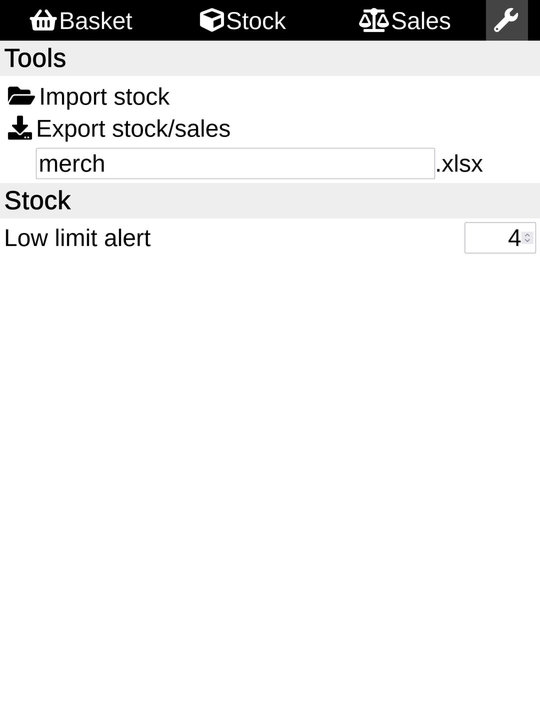
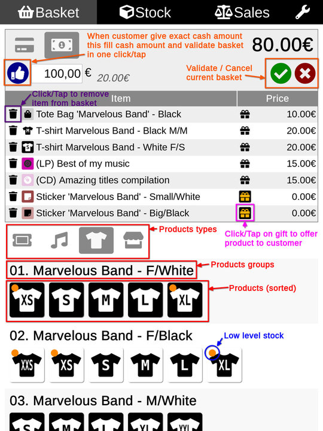
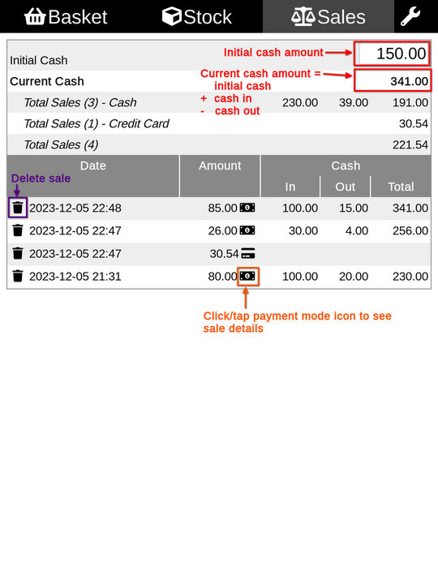

# Merch-999

## What Merch-999 is?
**Merch-999** is a small application designed to be used on a tablet or smartphone to manage your merch.

It has been implemented to help small bands during concerts:
- Easily prepare your merch stock
- Easily track entrances (how many, which amount)
- Easily manage merch sales (products, amount, stock, cash in, cash out...)
- Easily export results (Excel format)

## What Merch-999 is not?
Don't expect to use **Merch-999** to:
- Manage your global stocks
- Manage your accounting stuff

Basically:
- Import stock *before* concert
- Use application to manage entrances & merch sales
- Export stock & sales *after* concert
- Use results in your prefered application (Excel?)

## What does it look like?
Here Some screenshots

## How does it cost? Is there a license?
**Merch-999** is free and distributed under _GNU GPL v3 license_.
Some components of **Merch-999** are under _MIT_ and _CC-BY 4.0_ license (see licenses files in source code components directories).

> **In simple words, you're free to download, use, modify as well as redistribute **_Merch-999_** as long as this ability is preserved and you give contributors proper credit.**

## How to install?
**Merch-999** has been built from the most basic web technology: _HTML5_, _CSS3_, _Javascript_ and doesn't require strong skills to compile, build, manage thousands of dependencies or whatever made the web.

### You have a web-server
If you want to host your own **Merch-999**, you need a web-server to install it.

> Following steps assume that you have a web-server and you know how manage it

1) Download last release ZIP file
2) UNZIP content in your web server target directory, eventually `chmod +755` and that's all

> You may have some additional settings to do on web-server side if you want HTTPS protocol, dedicated sub-domain, ...

### You don't have a web-server, you don't even know what is it
Just go to https://merch.maou-maou.fr and enjoy **Merch-999**!

## Requirements
> Yes, requirements are listed after installation process 🙃

Except a web-server and a browser, you don't need anything else.
**Merch-999** is **one** HTML page.
There's no client-server communication, no database, no login/password, no account, no data hosted anywhere.

**Merch-999** has been built to be the most simple possible:
- I don't want to die with all security-stuff related with databases, account management, GDPR, client-server protocol, ...
- I don't want to have to manage miscellaneous technology, also web technologies & frameworks evolve every 6 months...
- I don't want to spent days and days to try to implement something really basic by learning and using new technologies and thousand of dependencies that I don't want to know about
- I don't want to have to manage and maintain a gas factory; big and complex software are more prone to bugs than really small ones (this doesn't mean **Merch-999** is bug free)

Also, consider that small bands often-sometimes perform their concerts and manage merch sales in small places where there's no -or really bad- internet connection.
Once the page is loaded, you can work offline, everything is managed within your browser: no internet connection is required.

## How to use

### Initialise stock
To initialise stock, start to go on _Tools_ page and click/tap on <kbd>Import stock</kbd>

Select `CSV` file to import
> The CSV file must be available and readbale from your device
> An example of stock CSV file is available in [sample](./samples/stock.csv) directory
> - CSV file contains explanations about how to use/fill it

When loaded, go to _Stock_ page

> Items for which current quantity is under defined limit (defined on page _Tools_) are highlighted in orange
> Items for which stock is empty are highlighted in red

> #### Take care!
> **Import of stock file will RESET current _stock_ and _sales_**

### Manage basket
When some stock is loaded and available, you can start to use basket.

- Products are organized by types (`type label` in CSV file)
- Products within types are grouped (`group label` in CSV file)
- Products within groups are sorted (`sort order` in CSV file)

Click/Tap on a product to add it in basket; basket content is updated:
- Product label & icon, price, are available in list
- Click/tap on left side trash icon to remove product from basket
- Click/tap on right side gift icon to offer product to customer

When a product stock is low, an orange bullet is displayed on product's icon.
When a product stock is empty, a red bullet is displayed on product's icon, and icon is disabled.
> Low limit level/stock empty is updated on basket page in real time

Click/tap on green 'check' icon to Validate basket:
- Sales are updated
- Stock is updated
- Basket is empty

Click/tap on red 'cross' icon to cancel basket:
- Sales are unchanged
- Stock is unchanged
- Basket is empty

When customer pay in cash and provide exact amount, click/tap on blue 'thumbs up' icon to set amount and validate basket in one action.

When customer pay in cash, amounts are provided for cash payment method.
Set given amount provided by customer, cash to give back in updated automatically (no need for mental calculation anymore! 😅)

When customer pay with a credit card, amounts are provided for credit card payment method.
Also in this case, no need to provide amount as it's considered the paid amount is the expected amount...

> Why different amount for credit card and cash?
> According to _electronic payment terminal_ used, you can have more or less fees on transactions and may not want to have to support them if fees are too high for you...
> In this case you can define a different price for credit card usage, it's up to you to decide

### Manage sales
You can check sales and available cash amount at any time in page _Sales_.

You have to set the initial cash with cash amount you have when starting the activity (you need some cash amount to be able to give back change to customer that don't have exact cash amount)
The current cash amount is udpated on each sale paid in cash.
> **Merch-999** use `Cash In` - `Cash Out` instead of `Amount` (easier to follow in/out for accounting).

Sale provides transaction date/time, amount, payment mode, and cash in/out if concerned.
Total cash in sale transaction indicate total cash amount available after transaction.

- Click/tap on left side trash icon to remove a sale
- Click/tap on payment mode icon to get details about sale

### Exporting results
Results can be exported in MS Excel file format (`.xlsx`)
To export, go on _Tools_ page and click/tap on <kbd>Export stock</kbd>

Exported file will contains 3 worksheets:
- Sales
- Sales details
- Stock
